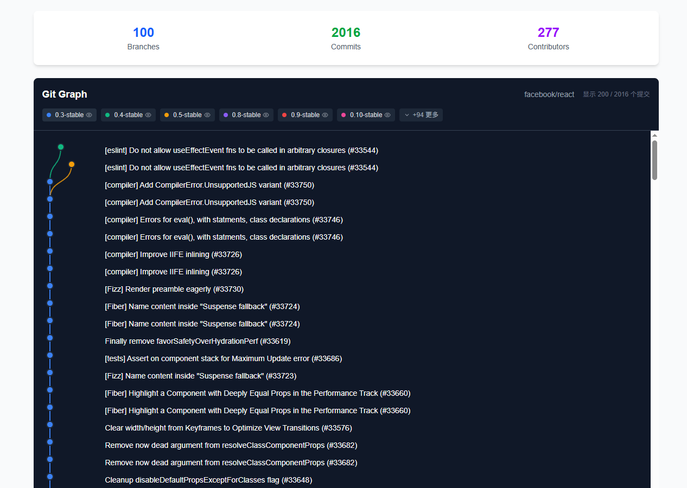

# Git Branch Visualizer

A modern, interactive Git branch and commit visualization tool built with Next.js. Visualize any public GitHub repository's git history with beautiful curved branch lines, just like VSCode's Git Graph extension.

[**中文文档**](README.zh-CN.md) | **English**



## ✨ Features

- **🌳 Interactive Git Graph**: Beautiful visualization of branches and commits with curved connecting lines
- **🎯 Branch Management**: Toggle visibility of individual branches with intuitive controls
- **🔍 Detailed Commit Info**: Hover tooltips showing commit details, file changes, and GitHub links
- **⚡ Performance Optimized**: Virtual scrolling and progressive loading for large repositories
- **🔑 GitHub Token Support**: Configure personal access tokens for higher API rate limits
- **📱 Responsive Design**: Works seamlessly on desktop and mobile devices
- **🎨 Modern UI**: Clean, dark theme interface similar to VSCode

## 🚀 Getting Started

### Prerequisites

- Node.js 18+ 
- pnpm (recommended) or npm

### Installation

1. **Clone the repository**
   ```bash
   git clone https://github.com/your-username/git-branch-graph.git
   cd git-branch-graph
   ```

2. **Install dependencies**
   ```bash
   pnpm install
   # or
   npm install
   ```

3. **Start development server**
   ```bash
   pnpm run dev
   # or
   npm run dev
   ```

4. **Open your browser**
   Navigate to [http://localhost:3000](http://localhost:3000)

## 📖 Usage

### Basic Usage

1. **Enter Repository URL**: Input any public GitHub repository URL or `owner/repo` format
2. **View Visualization**: Browse the interactive git graph with branches and commits
3. **Explore Commits**: Hover over commits to see detailed information
4. **Manage Branches**: Click branch tags to show/hide specific branches

### GitHub Token Configuration

For better performance and higher API rate limits:

1. **Click the Settings Icon** (⚙️) in the top-right corner
2. **Generate GitHub Token**:
   - Visit [GitHub Settings → Developer settings → Personal access tokens](https://github.com/settings/tokens)
   - Create a new token with `public_repo` permission
3. **Configure Token**: Paste the token in the settings modal
4. **Enjoy Enhanced Limits**: 5,000 requests/hour instead of 60

### Repository URL Formats

The tool supports various GitHub URL formats:

```
✅ https://github.com/facebook/react
✅ github.com/facebook/react
✅ facebook/react
```

## 🛠️ Tech Stack

- **Framework**: [Next.js 15](https://nextjs.org/) with App Router
- **Language**: [TypeScript](https://www.typescriptlang.org/)
- **Styling**: [Tailwind CSS v4](https://tailwindcss.com/)
- **Icons**: [Lucide React](https://lucide.dev/)
- **GitHub API**: [@octokit/rest](https://github.com/octokit/rest.js)
- **Date Handling**: [date-fns](https://date-fns.org/)
- **Fonts**: [Geist](https://vercel.com/font) (Sans & Mono)

## 📁 Project Structure

```
src/
├── app/                    # Next.js App Router
│   ├── layout.tsx         # Root layout with fonts
│   ├── page.tsx           # Main page with form and display
│   └── globals.css        # Global Tailwind styles
├── components/            # React components
│   ├── BranchVisualization.tsx  # Main visualization component
│   └── SettingsModal.tsx       # GitHub token settings
├── lib/                   # Utility libraries
│   └── github.ts          # GitHub API service
public/                    # Static assets
└── package.json          # Dependencies and scripts
```

## 🎛️ Available Scripts

```bash
# Development
pnpm run dev              # Start development server (with Turbopack)
pnpm run build            # Build for production
pnpm run start            # Start production server
pnpm run lint             # Run ESLint

# Type checking
npx tsc --noEmit          # Run TypeScript compiler check
```

## ⚡ Performance Features

- **Virtual Scrolling**: Only renders visible commits for smooth performance
- **Progressive Loading**: Load more commits on demand
- **Memoized Components**: Optimized React components to prevent unnecessary re-renders
- **Debounced Events**: Optimized hover and interaction handling
- **SVG Optimization**: Efficient rendering of branch lines and nodes

## 🔧 Configuration

### Environment Variables

Create a `.env.local` file (optional):

```env
# Optional: Set a default GitHub token
NEXT_PUBLIC_GITHUB_TOKEN=your_github_token_here
```

### GitHub API Limits

| Authentication | Rate Limit | Use Case |
|---------------|------------|----------|
| No Token | 60 requests/hour | Small repositories, testing |
| Personal Token | 5,000 requests/hour | Production use, large repositories |

## 🤝 Contributing

Contributions are welcome! Please feel free to submit a Pull Request.

1. **Fork the repository**
2. **Create your feature branch** (`git checkout -b feature/AmazingFeature`)
3. **Commit your changes** (`git commit -m 'Add some AmazingFeature'`)
4. **Push to the branch** (`git push origin feature/AmazingFeature`)
5. **Open a Pull Request**

## 📝 Development Guidelines

- **Code Style**: Follow the existing ESLint configuration
- **Commits**: Use conventional commit messages
- **TypeScript**: Maintain strict type safety
- **Performance**: Consider performance impact of new features
- **Accessibility**: Ensure features are accessible

## 🐛 Known Issues

- **Large Repositories**: Very large repositories (10,000+ commits) may take longer to load initially
- **Rate Limiting**: Without a GitHub token, you may hit API limits quickly
- **Branch Detection**: Complex branching strategies may not be perfectly detected

## 🛣️ Roadmap

- [ ] **Authentication**: Full GitHub OAuth integration
- [ ] **Export Features**: Export visualizations as images
- [ ] **Repository Comparison**: Compare multiple repositories
- [ ] **Commit Filtering**: Filter by author, date range, or message
- [ ] **Performance**: Further optimizations for extremely large repositories

## 📄 License

This project is licensed under the MIT License - see the [LICENSE](LICENSE) file for details.

## 🙏 Acknowledgments

- **GitHub API**: For providing excellent repository data access
- **VSCode Git Graph**: Inspiration for the visual design
- **Vercel**: For the amazing Next.js framework and deployment platform
- **Tailwind CSS**: For the utility-first CSS framework

## 📞 Support

If you encounter any issues or have questions:

1. **Check Issues**: Browse [existing issues](https://github.com/your-username/git-branch-graph/issues)
2. **Create Issue**: Submit a [new issue](https://github.com/your-username/git-branch-graph/issues/new)
3. **Documentation**: Review this README and inline code comments

---

**Made with ❤️ and TypeScript**

Star ⭐ this repository if you find it helpful!