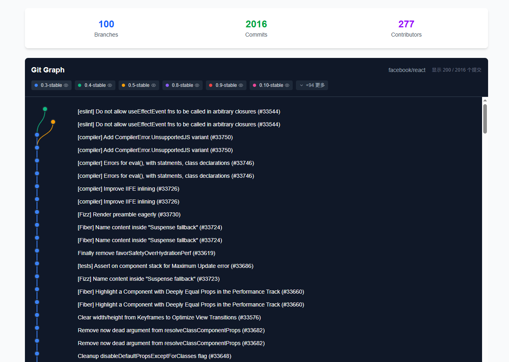

# Git 分支可视化工具

基于 Next.js 构建的现代化交互式 Git 分支和提交可视化工具。使用优美的曲线连接线可视化任何公开 GitHub 仓库的 Git 历史记录，就像 VSCode 的 Git Graph 扩展一样。

**中文文档** | [**English**](README.md)



## ✨ 特性

- **🌳 交互式 Git 图表**: 使用优美的曲线连接线可视化分支和提交
- **🎯 分支管理**: 直观控制单个分支的显示和隐藏
- **🔍 详细提交信息**: 悬浮提示显示提交详情、文件变更和 GitHub 链接
- **⚡ 性能优化**: 虚拟滚动和渐进加载支持大型仓库
- **🔑 GitHub Token 支持**: 配置个人访问令牌获得更高的 API 速率限制
- **📱 响应式设计**: 在桌面和移动设备上无缝工作
- **🎨 现代化界面**: 类似 VSCode 的简洁深色主题界面

## 🚀 快速开始

### 先决条件

- Node.js 18+ 
- pnpm（推荐）或 npm

### 安装

1. **克隆仓库**
   ```bash
   git clone https://github.com/your-username/git-branch-graph.git
   cd git-branch-graph
   ```

2. **安装依赖**
   ```bash
   pnpm install
   # 或者
   npm install
   ```

3. **启动开发服务器**
   ```bash
   pnpm run dev
   # 或者
   npm run dev
   ```

4. **打开浏览器**
   访问 [http://localhost:3000](http://localhost:3000)

## 📖 使用说明

### 基本使用

1. **输入仓库 URL**: 输入任何公开的 GitHub 仓库 URL 或 `owner/repo` 格式
2. **查看可视化**: 浏览包含分支和提交的交互式 Git 图表
3. **探索提交**: 悬浮在提交上查看详细信息
4. **管理分支**: 点击分支标签显示/隐藏特定分支

### GitHub Token 配置

为了获得更好的性能和更高的 API 速率限制：

1. **点击设置图标** (⚙️) 在页面右上角
2. **生成 GitHub Token**:
   - 访问 [GitHub 设置 → 开发者设置 → 个人访问令牌](https://github.com/settings/tokens)
   - 创建新 token，选择 `public_repo` 权限
3. **配置 Token**: 在设置弹窗中粘贴 token
4. **享受提升的限制**: 每小时 5,000 次请求而非 60 次

### 支持的仓库 URL 格式

工具支持多种 GitHub URL 格式：

```
✅ https://github.com/facebook/react
✅ github.com/facebook/react
✅ facebook/react
```

## 🛠️ 技术栈

- **框架**: [Next.js 15](https://nextjs.org/) with App Router
- **语言**: [TypeScript](https://www.typescriptlang.org/)
- **样式**: [Tailwind CSS v4](https://tailwindcss.com/)
- **图标**: [Lucide React](https://lucide.dev/)
- **GitHub API**: [@octokit/rest](https://github.com/octokit/rest.js)
- **日期处理**: [date-fns](https://date-fns.org/)
- **字体**: [Geist](https://vercel.com/font) (Sans & Mono)

## 📁 项目结构

```
src/
├── app/                    # Next.js App Router
│   ├── layout.tsx         # 根布局和字体配置
│   ├── page.tsx           # 主页面，包含表单和显示组件
│   └── globals.css        # 全局 Tailwind 样式
├── components/            # React 组件
│   ├── BranchVisualization.tsx  # 主要可视化组件
│   └── SettingsModal.tsx       # GitHub token 设置
├── lib/                   # 工具库
│   └── github.ts          # GitHub API 服务
public/                    # 静态资源
└── package.json          # 依赖和脚本
```

## 🎛️ 可用脚本

```bash
# 开发
pnpm run dev              # 启动开发服务器（使用 Turbopack）
pnpm run build            # 构建生产版本
pnpm run start            # 启动生产服务器
pnpm run lint             # 运行 ESLint

# 类型检查
npx tsc --noEmit          # 运行 TypeScript 编译器检查
```

## ⚡ 性能特性

- **虚拟滚动**: 只渲染可见的提交以确保流畅性能
- **渐进加载**: 按需加载更多提交
- **记忆化组件**: 优化的 React 组件防止不必要的重新渲染
- **防抖事件**: 优化悬浮和交互处理
- **SVG 优化**: 高效渲染分支连接线和节点

## 🔧 配置

### 环境变量

创建 `.env.local` 文件（可选）：

```env
# 可选：设置默认 GitHub token
NEXT_PUBLIC_GITHUB_TOKEN=your_github_token_here
```

### GitHub API 限制

| 认证方式 | 速率限制 | 使用场景 |
|---------|---------|----------|
| 无 Token | 60 次请求/小时 | 小型仓库、测试 |
| 个人 Token | 5,000 次请求/小时 | 生产使用、大型仓库 |

## 🤝 贡献

欢迎贡献！请随时提交 Pull Request。

1. **Fork 仓库**
2. **创建功能分支** (`git checkout -b feature/AmazingFeature`)
3. **提交更改** (`git commit -m 'Add some AmazingFeature'`)
4. **推送到分支** (`git push origin feature/AmazingFeature`)
5. **打开 Pull Request**

## 📝 开发指南

- **代码风格**: 遵循现有的 ESLint 配置
- **提交信息**: 使用约定式提交消息
- **TypeScript**: 保持严格的类型安全
- **性能**: 考虑新功能的性能影响
- **可访问性**: 确保功能具有可访问性

## 🐛 已知问题

- **大型仓库**: 非常大的仓库（10,000+ 提交）初始加载可能需要更长时间
- **速率限制**: 没有 GitHub token 时可能很快达到 API 限制
- **分支检测**: 复杂的分支策略可能无法完美检测

## 🛣️ 路线图

- [ ] **身份验证**: 完整的 GitHub OAuth 集成
- [ ] **导出功能**: 将可视化结果导出为图片
- [ ] **仓库对比**: 比较多个仓库
- [ ] **提交过滤**: 按作者、日期范围或消息过滤
- [ ] **性能优化**: 对超大型仓库的进一步优化

## 📄 许可证

本项目基于 MIT 许可证 - 查看 [LICENSE](LICENSE) 文件了解详情。

## 🙏 致谢

- **GitHub API**: 提供优秀的仓库数据访问
- **VSCode Git Graph**: 视觉设计灵感来源
- **Vercel**: 提供出色的 Next.js 框架和部署平台
- **Tailwind CSS**: 实用优先的 CSS 框架

## 📞 支持

如果遇到任何问题或有疑问：

1. **查看 Issues**: 浏览 [现有问题](https://github.com/your-username/git-branch-graph/issues)
2. **创建 Issue**: 提交 [新问题](https://github.com/your-username/git-branch-graph/issues/new)
3. **文档**: 查看此 README 和代码内注释

---

**用 ❤️ 和 TypeScript 制作**

如果觉得有帮助，请给这个仓库点个星 ⭐！